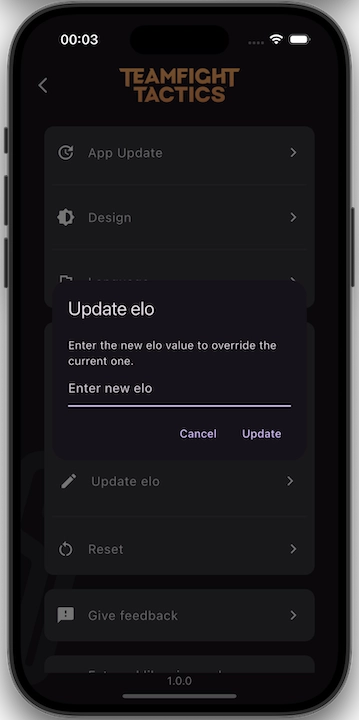

<table style="width: 100%; border-collapse: collapse;">
  <tr>
    <td style="text-align: center; width: 14.28%;">
       
      <h2 style="margin: 0;">Splash Screen</h2>
    </td>
    <td style="text-align: center; width: 14.28%;">
       
      <h2 style="margin: 0;">Ranked</h2>
    </td>
    <td style="text-align: center; width: 14.28%;">
       
      <h2 style="margin: 0;">Game Selected</h2>
    </td>
    <td style="text-align: center; width: 14.28%;">
       
      <h2 style="margin: 0;">Game Correct</h2>
    </td>
    <td style="text-align: center; width: 14.28%;">
       
      <h2 style="margin: 0;">Game Wrong</h2>
    </td>
    <td style="text-align: center; width: 14.28%;">
       
      <h2 style="margin: 0;">Ranked Elo Gain</h2>
    </td>
    <td style="text-align: center; width: 14.28%;">
       
      <h2 style="margin: 0;">Settings</h2>
    </td>
  </tr>
  <tr>
    <td style="text-align: center;">
       
      <h2 style="margin: 0;">Settings Update</h2>
    </td>
    <td style="text-align: center;">
       
      <h2 style="margin: 0;">Settings Design</h2>
    </td>
    <td style="text-align: center;">
       
      <h2 style="margin: 0;">Settings Language</h2>
    </td>
    <td style="text-align: center;">
       
      <h2 style="margin: 0;">Settings Check</h2>
    </td>
    <td style="text-align: center;">
       
      <h2 style="margin: 0;">Settings Repair</h2>
    </td>
    <td style="text-align: center;">
       
      <h2 style="margin: 0;">Settings Reset</h2>
    </td>
    <td style="text-align: center;">
       
      <h2 style="margin: 0;">Settings Feedback</h2>
    </td>
  </tr>
  <tr>
    <td style="text-align: center;">
       
      <h2 style="margin: 0;">Settings License</h2>
    </td>
    <td style="text-align: center;">
       
      <h2 style="margin: 0;">Settings Admin</h2>
    </td>
    <td style="text-align: center;">
       
      <h2 style="margin: 0;">Settings Update Elo</h2>
    </td>
    <td style="text-align: center;">
       
      <h2 style="margin: 0;">Patch Notes</h2>
    </td>
    <td colspan="3" style="text-align: center;">
      <!-- Empty cells for better alignment, or you can leave it out if not needed -->
    </td>
  </tr>
</table>

| <picture><source media="(prefers-color-scheme: dark)" srcset="/dark/splash_screen.webp"></picture> |             <picture><source media="(prefers-color-scheme: dark)" srcset="/dark/ranked.webp"></picture>              | <picture><source media="(prefers-color-scheme: dark)" srcset="/dark/game_selected.webp"></picture>  |     <picture><source media="(prefers-color-scheme: dark)" srcset="/dark/game_correct.webp"></picture>      |
|:-------------------------------------------------------------------------------------------------------------------------------------------------------------:|:-----------------------------------------------------------------------------------------------------------------------------------------------------------------:|:-------------------------------------------------------------------------------------------------------------------------------------------------------------:|:-------------------------------------------------------------------------------------------------------------------------------------------------------------------:|
|                                                                         Splash screen                                                                         |                                                                              Ranked                                                                               |                                                                         Game selected                                                                         |                                                                            Game correct                                                                             |
|     <picture><source media="(prefers-color-scheme: dark)" srcset="/dark/game_wrong.webp"></picture>      | <picture><source media="(prefers-color-scheme: dark)" srcset="/dark/ranked_elo_gain.webp"></picture> | <picture><source media="(prefers-color-scheme: dark)" srcset="/dark/settings.webp"></picture> | <picture><source media="(prefers-color-scheme: dark)" srcset="/dark/settings_update.webp"></picture> |
|                                                                          Game wrong                                                                           |                                                                          Ranked elo gain                                                                          |                                                                           Settings                                                                            |                                                                           Settings update                                                                           |

